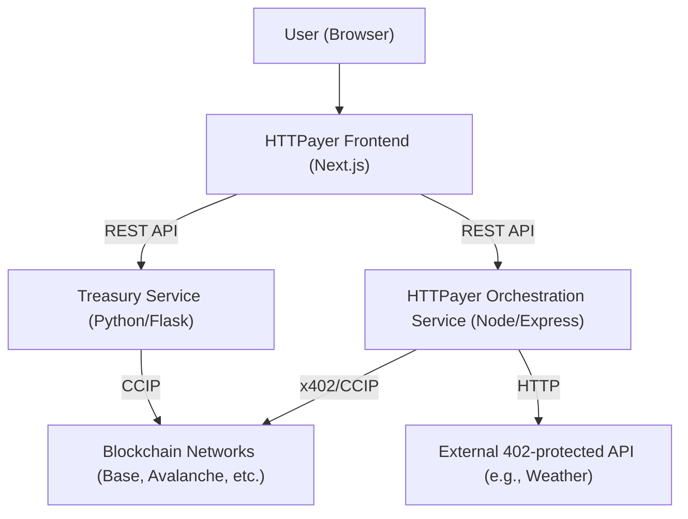
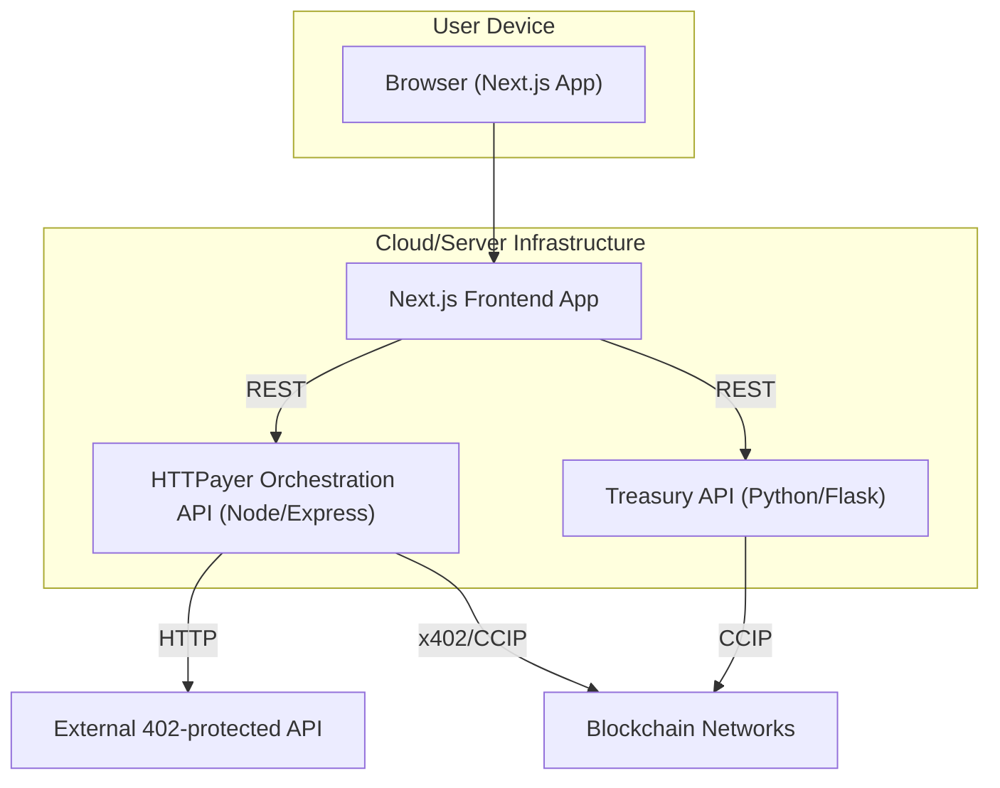

# Frontend Architecture

This document outlines the architecture of the HTTPayer frontend. It is designed
to serve as a guide for both human developers and AI code assistants like Cursor
to understand the project's structure, data flow, and core principles.

**Core Technologies:**

- **Framework:** Next.js (App Router, with emphasis on Server Components and
  Server Actions)
- **Language:** TypeScript
- **Styling:** Tailwind CSS (Utility-First)
- **Wallet/Blockchain Interaction:** `wagmi` & `viem` (primarily for wallet
  connection and signature requests sent to backend)
- **Server State & Data Fetching:** TanStack Query (`@tanstack/react-query`)
- **Deployment Target:** Vercel

## 1. Core Principles

- **Blockchain Abstraction:** The frontend explicitly abstracts away direct
  blockchain interactions. All on-chain logic (payments, CCIP transfers,
  treasury management) is handled by the HTTPayer backend services. The frontend
  primarily interacts with the backend via RESTful APIs and focuses on the x402
  protocol flow.
- **React Server Components First:** The Next.js App Router favors React Server
  Components (RSCs) by default for optimal performance, reduced client bundle
  size, and efficient data fetching. Components are Server Components unless
  explicitly marked with `"use client";`.
- **Server Actions for Mutations:** Server Actions are the preferred method for
  handling data mutations and form submissions directly from client or server
  components, enabling direct server-side data manipulation without explicit API
  routes.
- **Component-Based:** The UI is composed of small, reusable, and self-contained
  React components located in `src/components`. Components are chosen as Server
  or Client components based on their interactivity and data requirements.
- **Client-Centric & Real-Time (for interactivity):** While RSCs handle initial
  renders, interactive parts of the application (e.g., wallet connection, live
  dashboards, user input) are implemented as Client Components. These rely
  heavily on client-side rendering and data fetching to provide a real-time view
  of the system's state. TanStack Query is used for polling backend services
  within Client Components.
- **Clear State Separation:** State management is strictly divided as detailed
  in `.cursorrules/state-management.md`.
- **Utility-First Styling:** All styling is done via
  [Tailwind CSS](https://tailwindcss.com/) as detailed in
  `.cursorrules/styling.md`.

## X. Type Safety Principles

To ensure maximum reliability and maintainability, HTTPayer enforces strict type
safety at both compile-time and runtime.

### 1. TypeScript Strictness

- All code must be written in TypeScript.
- The following `tsconfig.json` flags **must** be enabled:
  - `"strict": true`
  - `"noImplicitAny": true`
  - `"strictNullChecks": true`
  - `"strictFunctionTypes": true`
  - `"strictBindCallApply": true`
  - `"strictPropertyInitialization": true`
  - `"noImplicitThis": true`
  - `"alwaysStrict": true`
  - `"noUnusedLocals": true`
  - `"noUnusedParameters": true`
  - `"noFallthroughCasesInSwitch": true`
  - `"exactOptionalPropertyTypes": true`
  - `"noUncheckedIndexedAccess": true`

### 2. API Types and Runtime Validation

- All API request and response types **must** be defined as TypeScript types or
  interfaces in `src/types/api.ts` (or similar shared location).
- All external data (API responses, user input, environment variables) **must**
  be validated at runtime using [Zod](https://zod.dev/) schemas (or a similar
  library).
- Types for API data **must** be inferred from Zod schemas to guarantee
  alignment between runtime and compile-time types.
- Example:
  ```typescript
  import { z } from "zod";
  export const TreasuryBalancesResponseSchema = z.object({
      base: z.object({
          usdc_balance: z.string(),
          eth_balance: z.string(),
          burn_rate_daily: z.string().optional(),
          runway_days: z.string().optional(),
          status: z.enum(["online", "offline"]).optional(),
      }),
      avalanche: z.object({
          usdc_balance: z.string(),
          avax_balance: z.string(),
          burn_rate_daily: z.string().optional(),
          runway_days: z.string().optional(),
          status: z.enum(["online", "offline"]).optional(),
      }),
      facilitators: z.object({
          base: z.enum(["online", "offline", "unknown"]),
          avalanche: z.enum(["online", "offline", "unknown"]),
      }),
  });
  export type TreasuryBalancesResponse = z.infer<
      typeof TreasuryBalancesResponseSchema
  >;
  ```

### 3. Branded Types for Domain Safety

- Use
  [branded types](https://medium.com/@gvelosa/branded-types-in-typescript-stronger-type-safety-for-your-codebase-3f2125c28b43)
  for critical domain values (e.g., addresses, message IDs, chain names) to
  prevent accidental misuse.
- Example:
  ```typescript
  type Address = string & { __brand: "Address" };
  type MessageId = string & { __brand: "MessageId" };
  ```

### 4. Environment Variable Safety

- All environment variables must be validated at runtime (e.g., using Zod)
  before use.
- Example:
  ```typescript
  import { z } from "zod";
  const EnvSchema = z.object({
      NEXT_PUBLIC_HTTPAYER_API_URL: z.string().url(),
      NEXT_PUBLIC_TREASURY_API_URL: z.string().url(),
      NEXT_PUBLIC_HTTPAYER_API_KEY: z.string().min(1),
  });
  export const env = EnvSchema.parse(process.env);
  ```

### 5. Exhaustive Error Typing

- All error objects and edge cases must be exhaustively typed and handled in
  both API and UI code.
- Use discriminated unions for error types where appropriate.

### 6. Location of Types and Schemas

- All shared types/interfaces should be placed in `src/types/`.
- All Zod schemas should be placed in `src/schemas/`.
- API contract types must be kept in sync with the "Backend Interaction
  Specifications" in this document.

## 2. Directory Structure

```
frontend/
├── .env.local          # Environment variables (untracked)
├── next.config.mjs       # Next.js configuration
├── tailwind.config.ts    # Tailwind CSS configuration
├── tsconfig.json         # TypeScript configuration
├── .cursorrules/         # Directory containing AI/LSP-specific coding rules
│   ├── general.md          # General project rules and principles
│   ├── state-management.md # Guidelines for handling different types of state
│   ├── styling.md          # Rules for Tailwind CSS usage
│   ├── component-structure.md # Rules for component placement and design (including RSC/Client Component decisions)
│   ├── api-interaction.md  # Rules for data fetching and API calls
│   └── code-generation.md  # Specific directives for AI code generation
├── src/
│   ├── app/
│   │   ├── globals.css   # Global styles and Tailwind directives
│   │   ├── layout.tsx    # Root layout (Server Component by default)
│   │   ├── page.tsx      # Main entry point (Server Component by default), composes Client Components
│   │   ├── providers.tsx # Client-side provider setup (Wagmi, React Query) - **MUST BE "use client";**
│   │   └── actions.ts    # Centralized Server Actions for data mutations (if needed)
│   │
│   ├── components/
│   │   ├── Header.tsx        # Top bar: Title and Wallet Connect button (**"use client";**)
│   │   ├── Dashboard.tsx     # Displays live balances and system status via polling (**"use client";**)
│   │   ├── PaymentDemo.tsx   # Interactive component to trigger and visualize a cross-chain payment (**"use client";**)
│   │   └── (Other potential Server Components if needed)
│   │
│   └── wagmi.ts            # Wagmi configuration (chains, transports)
```

## 3. Visual Architecture: C4 Model

To provide a clear, multi-level view of the system, we use the
[C4 model](https://c4model.com/) for software architecture diagrams. This helps
both technical and non-technical stakeholders understand the system at different
levels of abstraction.

### 3.1. System Context Diagram (C4 Level 1)

This diagram shows the HTTPayer system in its environment: users, backend
services, and external systems.



**Description:**

- The user interacts with the HTTPayer frontend.
- The frontend communicates with backend orchestration and treasury services.
- Backend services interact with blockchain networks and external APIs as
  needed.

### 3.2. Container Diagram (C4 Level 2)

This diagram zooms into the HTTPayer system, showing the main containers
(applications/services) and their relationships.



**Description:**

- The browser runs the Next.js frontend app.
- The frontend app communicates with two backend APIs: the HTTPayer
  Orchestration API and the Treasury API.
- The orchestration API handles payment flows and interacts with both external
  APIs and blockchain networks.
- The treasury API manages balances and cross-chain transfers via CCIP.

---

## 4. Component Breakdown

- **`layout.tsx` and `page.tsx`**: These are React Server Components by default.
  `layout.tsx` provides the base structure and wraps `page.tsx` with providers
  for client-side functionality. `page.tsx` then orchestrates and renders the
  necessary client components for interactivity, including the Chainlink
  Functions status placeholder.
- **`Header.tsx`**: Client Component for wallet connection and user interaction.
- **`Dashboard.tsx`**: Client Component for live balances and system status
  (CCIP, treasury), using real API integration.
- **`PaymentDemo.tsx`**: Client Component for interactive x402 payment demo,
  using real API integration for the `/httpayer` endpoint.
- **`ChainlinkFunctionsStatus.tsx`**: Client Component that provides a static,
  narrative-supporting placeholder for Chainlink Functions integration. It
  displays a prominent title, concise description (from the demo script), and a
  status indicator ("In Development"). This component is integrated into
  `page.tsx` to visually acknowledge ongoing/future Chainlink Functions work for
  hackathon/demo alignment.
- **Server Actions (e.g., in `app/actions.ts`)**: These functions can be
  directly imported and called from Client or Server Components. They execute
  exclusively on the server, allowing for direct database or external API
  interactions without creating separate API routes.

## 5. Data Flow

### Wallet Connection (Client-Side for Signing Requests)

1. User clicks "Connect Wallet" in `<Header />` (a Client Component).
2. `wagmi`'s `useConnect` hook is called.
3. Wagmi handles the wallet provider interaction, potentially connecting to
   public RPC endpoints or using wallet-provided RPCs for basic connection and
   balance reads (not handled by HTTPayer backend).
4. On success, `useAccount` provides the user's address and connection status.
5. If an EIP-712/EIP-3009 signature is required by the x402 protocol, the wallet
   (via `wagmi`/`viem`) signs the message, and this signature is then passed to
   the HTTPayer backend for verification and on-chain settlement.

### Live Dashboard Data (Client-Side, Backend-Provided)

1. `<Dashboard />` (a Client Component) mounts.
2. `useQuery({ queryKey: ['dashboardData'], ... })` is triggered within the
   client component.
3. The query function fetches data from the **Treasury API**
   (`/treasury/balances`), which handles all underlying blockchain data
   retrieval.
4. TanStack Query manages the loading state and caches the result on the client.
5. The UI displays the data.
6. Every 5 seconds, TanStack Query automatically re-fetches the data in the
   background and updates the Client Component UI.

### Interactive Payment Flow (Client-Side, Backend-Orchestrated)

1. User clicks "Get Weather..." button in `<PaymentDemo />` (a Client
   Component).
2. `handlePayment` function is called. `isLoading` state is set to `true`
   (Client Component local state).
3. A series of `useState` updates show the user a simulated progress through the
   payment steps.
4. An `async` function makes a `POST` request to the **HTTPayer Orchestration
   Service** (`/httpayer` endpoint), providing the target `api_url` and
   `method`. This service then handles the entire x402 payment, including any
   on-chain interactions (e.g., token transfers via Chainlink CCIP).
5. On a successful response from the backend (which is the direct content of the
   paid-for API), the result is stored in the `result` state variable (Client
   Component local state).
6. The UI displays the final API response. `isLoading` is set to `false`.

### Data Mutations via Server Actions (Optional/Future)

1. A user performs an action (e.g., submitting a form, clicking a button) that
   triggers a mutation.
2. A Server Action function (defined in `app/actions.ts` or directly within a
   Server Component) is called.
3. This Server Action executes on the server, allowing it to perform backend
   operations (e.g., update a database, call an internal API).
4. The Server Action can revalidate cached data (`revalidatePath`,
   `revalidateTag`) or return data to the client component.

## 6. Backend Interaction Specifications

This section details the precise interaction patterns between the frontend
(client-side components) and the HTTPayer backend services.

### 6.1. HTTPayer Orchestration Service (Node/Express)

- **Base URL:** `NEXT_PUBLIC_HTTPAYER_API_URL` (e.g.,
  `http://provider.boogle.cloud:31157/httpayer`)

- **Endpoint: `POST /httpayer`**
  - **Description:** Orchestrates the automated payment via x402 protocol and
    retrieves the content from a protected API resource.
  - **Purpose:** Primary entry point for the frontend to request a 402-gated
    resource via HTTPayer.
  - **Request Headers:**
    - `x-api-key: string` (Required. Your HTTPayer API key, e.g., derived from
      `process.env.NEXT_PUBLIC_HTTPAYER_API_KEY`)
    - `Content-Type: application/json`
  - **Request Body (JSON):**
    ```typescript
    type HttpRequestPayload = {
        api_url: string; // The URL of the 402-protected target API
        method: "GET" | "POST" | "PUT" | "DELETE"; // HTTP method for the target API
        payload?: Record<string, unknown>; // Optional JSON payload for the target API's request
    };
    ```
  - **Expected Success Response (Status 200 OK):**
    - **Content-Type:** Varies, depending on the `api_url`'s resource (e.g.,
      `application/json` for weather data).
    - **Body:** The actual content (JSON, text, etc.) returned by the _target
      protected API_ after successful payment. _Example for a weather API:_
      ```json
      {
          "temp": 25,
          "weather": "sunny",
          "location": "Avalanche Fuji"
      }
      ```
  - **Expected Error Responses:**
    - **Status 400 Bad Request:**
      - **Body:** `{ "error": "string", "details?": "string" }` (e.g., missing
        `api_url`, invalid method).
    - **Status 401 Unauthorized:**
      - **Body:** `{ "error": "string" }` (e.g., missing or invalid
        `x-api-key`).
    - **Status 402 Payment Required:** (Unlikely for the client, as HTTPayer
      handles this internally, but possible if the target API has complex 402
      scenarios not fully covered).
      - **Body:** Standard 402 response, potentially with `X-Payment-Required`
        header.
    - **Status 500 Internal Server Error:**
      - **Body:** `{ "error": "string" }` (e.g., network issues during
        orchestration, target API unreachable, unhandled server exception).

### 6.2. Treasury Service (Python/Flask)

- **Base URL:** `NEXT_PUBLIC_TREASURY_API_URL` (e.g.,
  `http://provider.boogle.cloud:32279/treasury`)

- **Endpoint: `GET /treasury/balances`**
  - **Description:** Retrieves current USDC and gas balances for treasury
    wallets on supported chains, along with facilitator status.
  - **Purpose:** Populates the `Dashboard.tsx` component with real-time
    financial and operational data.
  - **Request:** No body or query parameters.
  - **Expected Success Response (Status 200 OK, JSON):**
    ```typescript
    type TreasuryBalancesResponse = {
        base: {
            usdc_balance: string; // USDC balance on Base Sepolia (e.g., "1234.56")
            eth_balance: string; // ETH balance for gas on Base Sepolia (e.g., "0.012345")
            burn_rate_daily?: string; // Optional: Daily burn rate (e.g., "10.50 USDC/day")
            runway_days?: string; // Optional: Estimated runway (e.g., "30 days")
            status?: "online" | "offline"; // Optional: Chain specific status
        };
        avalanche: {
            usdc_balance: string; // USDC balance on Avalanche Fuji (e.g., "789.01")
            avax_balance: string; // AVAX balance for gas on Avalanche Fuji (e.g., "0.00567")
            burn_rate_daily?: string; // Optional: Daily burn rate
            runway_days?: string; // Optional: Estimated runway
            status?: "online" | "offline"; // Optional: Chain specific status
        };
        facilitators: { // Consolidated status of deployed facilitators
            base: "online" | "offline" | "unknown";
            avalanche: "online" | "offline" | "unknown";
            // ... other chains as supported
        };
    };
    ```
  - **Expected Error Responses:**
    - **Status 500 Internal Server Error:**
      - **Body:** `{ "error": "string" }` (e.g., backend issue fetching chain
        data).

- **Endpoint: `POST /treasury/transfer`**
  - **Description:** Initiates a cross-chain USDC transfer via Chainlink CCIP
    from the treasury.
  - **Purpose:** Used for treasury management operations (less common for direct
    frontend user interaction in the demo, but included for completeness if a
    "manual transfer" demo is added).
  - **Request Body (JSON):**
    ```typescript
    type TransferRequest = {
        dest: "base" | "avalanche"; // Destination chain identifier (required)
        amount: number; // Amount of USDC to transfer (e.g., 123.45) (required)
        to?: string; // Optional: Destination wallet address (defaults to treasury's address on dest chain if omitted)
    };
    ```
  - **Expected Success Response (Status 200 OK, JSON):**
    ```typescript
    type TransferResponse = {
        success: boolean;
        message: string;
        message_id: string; // Chainlink CCIP message ID
        receipt?: Record<string, unknown>; // Transaction receipt object (source chain)
        links?: { // Explorer links for tracing
            source_tx?: string;
            destination_tx?: string;
            ccip_explorer?: string;
        };
    };
    ```
  - **Expected Error Responses:**
    - **Status 400 Bad Request:**
      - **Body:** `{ "error": "string", "details?": "string" }` (e.g., invalid
        amount, unsupported destination).
    - **Status 500 Internal Server Error:**
      - **Body:** `{ "error": "string" }` (e.g., CCIP call failure, insufficient
        funds).

- **Endpoint: `POST /treasury/check_status`**
  - **Description:** Checks the status of a previously initiated Chainlink CCIP
    transfer.
  - **Purpose:** For tracking cross-chain transfers (could be used for a more
    advanced "recent transactions" list with status updates).
  - **Request Body (JSON):**
    ```typescript
    type CheckStatusRequest = {
        message_id: string; // The Chainlink CCIP message ID from a /treasury/transfer response (required)
        dest: "base" | "avalanche"; // Destination chain identifier (required)
    };
    ```
  - **Expected Success Response (Status 200 OK, JSON):**
    ```typescript
    type CheckStatusResponse = {
        status: "pending" | "complete" | "failed" | "unknown"; // Current status of the CCIP transfer
        source_tx_hash?: string; // Optional: Hash of source chain transaction
        destination_tx_hash?: string; // Optional: Hash of destination chain transaction
        error?: string; // Optional: If status is 'failed', details about the error
        last_update?: string; // Optional: Timestamp of last status update
    };
    ```
  - **Expected Error Responses:**
    - **Status 400 Bad Request:**
      - **Body:** `{ "error": "string" }` (e.g., missing `message_id`, invalid
        `dest`).
    - **Status 500 Internal Server Error:**
      - **Body:** `{ "error": "string" }` (e.g., issue querying CCIP status).

## 7. Environment Variables

All client-side environment variables must be prefixed with `NEXT_PUBLIC_`.
Create a `.env.local` file for development.

```env
# Example
NEXT_PUBLIC_HTTPAYER_API_URL=http://provider.boogle.cloud:31157/httpayer
NEXT_PUBLIC_TREASURY_API_URL=http://provider.boogle.cloud:32279/treasury
```

## 8. Deployment

The HTTPayer frontend is designed for deployment on **Vercel**.

- **Seamless Next.js Integration:** Vercel is highly optimized for Next.js
  applications, providing automatic build, deployment, and scaling from a GitHub
  repository.
- **Global Edge Network:** Leveraging Vercel's Edge Network, the application can
  achieve low-latency delivery to users worldwide, crucial for a global payment
  dashboard.
- **Serverless Functions (APIs):** While our primary backend is external,
  Vercel's serverless functions could be leveraged for future
  backend-for-frontend (BFF) patterns or simpler API routes if needed, further
  integrating the vertical stack.
- **Automatic Scaling:** Vercel automatically scales the application to handle
  traffic spikes, ensuring reliability during demonstrations or future
  high-usage scenarios.

## 9. Demo Strategy & Narrative Alignment

- The demo is structured to maximize clarity and impact for hackathon judges:
  - **Flawless Core Demo:** The highest priority is a working, visually clear
    demonstration of cross-chain USDC transfers (CCIP) and the x402 payment
    flow, as implemented in `Dashboard.tsx` and `PaymentDemo.tsx`.
  - **Narrative-Supporting Placeholders:** For features that are in-progress or
    on the roadmap (e.g., Chainlink Functions integration), dedicated UI
    components like `ChainlinkFunctionsStatus.tsx` are included to explicitly
    acknowledge and explain these features, supporting the script and maximizing
    bonus points for "multiple Chainlink services."
  - **UI Polish & Testing:** The UI is designed to be clean, professional, and
    responsive, with comprehensive testing to ensure a smooth demo experience.
